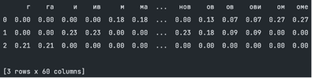
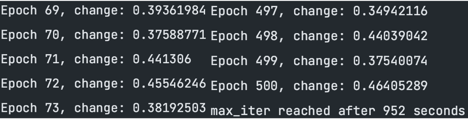
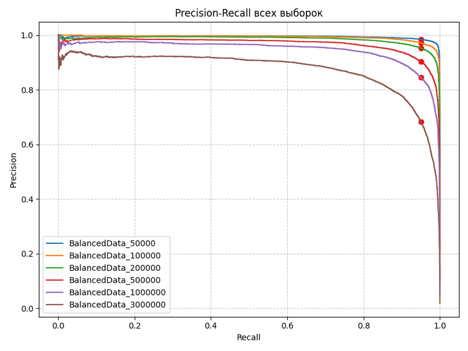
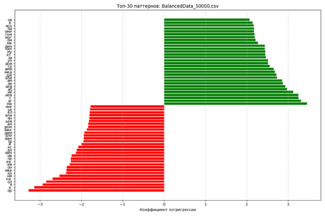
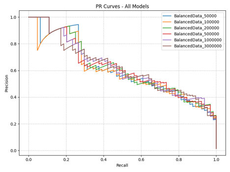
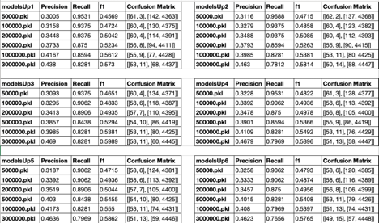

# 1. Введение
---
## 1.1 Цель проекта
Построить и протестировать ML-модель первичного скрининга по ФИО для выявления студентов дагестанского происхождения и применить её к базе
студентов МГТУ, при этом сохранить высокий охват (*recall*) и добиться приемлемой точности (*precision*) для дальнейшей ручной классификации.

## 1.2 Конкретные задачи
1. Сформировать и обработать обучающие и тестовые датасеты (открытый корпус + собственный сбор дагестанских ФИО).
2. Обучить модели на сбалансированных выборках разного масштаба и сравнить их поведение.
3. Выстроить итеративную процедуру очистки шумных меток в большом корпусе (*self-training*).
4. Оценить модель на отложенной выборке (`filtered_data1.csv`) и применить финальную модель к данным студентов МГТУ.
5. Произвести ручную проверку кандидатов и пересчитать итоговые метрики и окончательное количество дагестанцев.

# 2. Подготовка данных ([DataPipeline.py](main_folder/DataPipeline.py))
---
## 2.1 Источники данных
Для обучения и валидации использовались три основных корпуса:

- [RussianNames.csv](main_folder/data/RussianNames.csv) — большой открытый набор русских ФИО (~ 6 млн записей).
  Этот набор содержит шум: в нём встречаются студенты кавказского происхождения, ошибочно размеченные как «0».

- [DagestanNames.csv](main_folder/data/DagestanNames.csv) — специализированный корпус (~54 тыс. записей), собранный вручную из закрытых источников.
  Он включает фамилии, имена и отчества, характерные для дагестанских этносов.
  *(часть собранных ФИО содержит личные данные; здесь публикуются только агрегированные результаты и обезличенные примеры).*

- [filtered_data1.csv](main_folder/TestData/filtered_data1.csv) — вручную размеченный набор, включающий **4570 ФИО первокурсников**, из которых **64 — дагестанцы**.

Первые два корпуса служат базой для формирования сбалансированных выборок разного масштаба.
Последний используется для точной проверки модели.


## 2.2 Предобработка данных
Этапы очистки и стандартизации:

1. Удаление записей с пропущенными значениями (`NaN`).
2. Приведение строк к единому регистру (нижний или правильный регистр, в зависимости от задачи).
3. Проверка уникальности и исключение дубликатов.
<details>
<summary> Код </summary>

```python
def clean_dataframe(df: pd.DataFrame, drop_col: str = None) -> pd.DataFrame:
    """
    Очистка датафрейма:
    1. Удаление NaN
    2. Приведение строк к нижнему регистру
    3. Удаление дубликатов
    """
    # Удаляем ненужный столбец
    if drop_col and drop_col in df.columns:
        df = df.drop(drop_col, axis=1)
    # Удаляем NaN
    df = df.dropna()
    # Приводим все строковые столбцы к нижнему регистру
    for col in df.select_dtypes(include="object").columns:
        df.loc[:, col] = df[col].str.lower()
    # Удаляем дубликаты
    df = df.drop_duplicates()
    return df

def prepare_dataset(dag_file="data/DagestanNames.csv",
                    ru_file="data/RussianNames.csv",
                    output_combined="data/DataAboutNames.csv") -> pd.DataFrame:
    """Подготавливает Dagestan и Russian датасеты """
    # Dagestan
    df_dag = pd.read_csv(dag_file)
    df_dag.columns = ["Ф", "И", "О"]
    df_dag["класс"] = 1
    df_dag = clean_dataframe(df_dag)
    df_dag.to_csv("data/DagReady.csv", index=False)

    # Russian
    df_ru = pd.read_csv(ru_file, names=["Ф", "И", "О", "Пол"])
    df_ru["класс"] = 0
    df_ru = clean_dataframe(df_ru, drop_col="Пол")
    df_ru.to_csv("data/RuReady.csv", index=False)

```
</details>

## 2.3 Балансировка данных
Для обучения моделей важен баланс классов.
Так как класс «0» значительно больше (~6 млн против ~54 тыс.), используется процедура случайной подвыборки (`sample`) из большего класса.

Реализовано создание подмножеств с разными размерами класса «0»:
**50k, 100k, 200k, 500k, 1M, 3M, 6M**.
Каждый раз к подвыборке добавляются все объекты класса «1».

```python
import pandas as pd
from sklearn.utils import shuffle
import os
def generate_balanced_datasets(dag_file="data/DagReady.csv",
                               ru_file="data/RuReady.csv",
                               output_dir="DataUP/datafortrain",
                               sample_sizes=(50_000, 100_000, 200_000, 500_000, 1_000_000, 3_000_000, 6_000_000),
                               random_state=42):
    """
    Генерирует несколько сбалансированных датасетов:
    - Берёт всех из dag_file (дагестанцы, класс=1)
    - Подмешивает случайные подвыборки из ru_file (русские, класс=0)
    - Сохраняет результат в CSV
    """
    os.makedirs(output_dir, exist_ok=True)

    # Загружаем файлы
    dag = pd.read_csv(dag_file)   # все дагестанцы (~54k)
    ru = pd.read_csv(ru_file)     # все русские (~6M)
    print(f"[ИНФО] Загружено: {dag.shape[0]} дагестанцев и {ru.shape[0]} русских")

    for size in sample_sizes:
        # Берём подвыборку русских
        ru_sampled = ru.sample(n=size, random_state=random_state)

        # Объединяем с дагестанцами
        df_balanced = pd.concat([dag, ru_sampled], axis=0)
        df_balanced = shuffle(df_balanced, random_state=random_state).reset_index(drop=True)

        # Сохраняем
        output_file = os.path.join(output_dir, f"BalancedData_{size}.csv")
        df_balanced.to_csv(output_file, index=False)

        print(f"[ИНФО] Сбалансированный набор BalancedData_{size}.csv сохранён")
        print(df_balanced["класс"].value_counts())
```
Запуск функции **generate_balanced_datasets()** создаёт серию файлов **BalancedData_size.csv** для обучения моделей.
Балансировка позволила сформировать обучающие подвыборки с контролируемым масштабом классов.
Подготовленные датасеты стали основой для последующего обучения моделей.

# 3. Первичное обучение моделей
---
## 3.1 Выбор метрики

На первом этапе мы обучаем базовую модель, ориентируясь на максимальный **recall** (полноту).  
Это связано с поставленной задачей:  
- мы не хотим потерять ни одного дагестанца,  
- лучше «захватить лишних» и позже вручную отфильтровать, чем упустить положительный объект.  

Таким образом, **recall фиксируется ≥ 0.95**, а **precision** в этой постановке уходит на второй план.

## 3.2 Архитектура модели

Мы используем классическую ML-парадигму:  
- преобразуем ФИО в символьные **n-граммы** (2–3 символа),  
- вычисляем **TF–IDF** для этих n-грамм,  
- обучаем **логистическую регрессию** с балансировкой весов классов.

Пояснение:  

1. n-граммы фиксированной длины (2–3 символа) позволяют уловить характерные морфологические паттерны в ФИО, не запоминая полностью конкретные имена и фамилии.  
2. TF-IDF (**Term Frequency — Inverse Document Frequency**) оценивает важность каждого токена относительно всего корпуса:   
   -  **TF** — частота появления токена в ФИО  
   -  **IDF** — обратная частота токена во всём наборе данных, что снижает вес часто встречающихся суффиксов
```python
import pandas as pd
from sklearn.feature_extraction.text import TfidfVectorizer

names = [
    "Магомед Магомедов Магомедович",
    "Иван Иванов Иванович",
    "Гаджи Гаджиев Гаджиевич"
]

vectorizer = TfidfVectorizer(analyzer="char", ngram_range=(2,3))
X = vectorizer.fit_transform(names)

df_tfidf = pd.DataFrame(X.toarray(), columns=vectorizer.get_feature_names_out())
print(df_tfidf.round(2))
```



3. Логистическая регрессия
   -   Интерпретируемость: коэффициенты модели позволяют понять, какие символы или паттерны ФИО наиболее значимы для прогнозирования принадлежности к дагестанскому этносу.
   -    Простота и скорость обучения на больших разреженных матрицах, которые возникают после TF-IDF векторизации.

**Ключевые параметры модели:**
   - class_weight="balanced" — компенсирует дисбаланс классов
   - max_iter=500 — ограничение итераций
   - solver="sag" — стохастический градиент, подходит для больших разреженных матриц
   - n_jobs=-1 — использует все доступные ядра процессора для параллельных вычислений
   - verbose=1 — выводит в консоль прогресс обучения
   - C — коэффициент регуляризации (обратный, чем меньше -> сильнее штраф за сложность модели)

## 3.3 Код обучения ([LogRegRecall.py](main_folder/LogRegRecall.py))
Часть кода:
```python
def train_models(
        data_files,
        recall_thr = 0.9,
        base_folder="models",
        datafortrain= "datafortrain",
        ngram_range=(2, 3),
        max_iter=500,
        C=1.0,
):
    """
    Обучение логистической регрессии на нескольких CSV-файлах.
    Сохраняет модели и пороги, метрики, PR/ROC кривые, графики топ-признаков.
    Все модели будут храниться в base_folder
    Данные для обучения будут браться из директории datafortrain
    Фиксация Recall через recall_thr
    """
    # Векторизация
    vectorizer = TfidfVectorizer(analyzer="char", ngram_range=ngram_range)
    model = LogisticRegression(
        class_weight="balanced",
        max_iter=max_iter,
        solver="sag",
        n_jobs=-1,
        verbose=1,
        C=C
    )
```
Запуск обучения:
```python
data_files = [
    "BalancedData_50000.csv",
    "BalancedData_100000.csv",
    "BalancedData_200000.csv",
    "BalancedData_500000.csv",
    "BalancedData_1000000.csv",
    "BalancedData_3000000.csv",
    #"BalancedData_6000000.csv",
]

train_models(
    data_files,
    base_folder="models",
    datafortrain="datafortrainUp5",
    recall_thr=0.95,
    ngram_range=(2, 3),
    max_iter=500,
    C=1
)
```

## 3.4 Результаты первых экспериментов
Метрики: 

| File                      | Best Threshold | Precision | Recall |  F1   | Feature | Training Time (m) |
|:--------------------------|:--------------:|:---------:|:------:|:-----:|:-------:|:-----------------:|
| BalancedData_50000.csv    |     0.866      |   0.996   | 0.952  | 0.973 |  11312  |       0.036       |
| BalancedData_100000.csv   |     0.862      |   0.993   | 0.951  | 0.971 |  12208  |       0.048       |
| BalancedData_200000.csv   |     0.879      |   0.988   | 0.951  | 0.969 |  13425  |       0.081       |
| BalancedData_500000.csv   |     0.911      |   0.976   | 0.950  | 0.963 |  15359  |       0.203       |
| BalancedData_1000000.csv  |     0.918      |   0.962   | 0.950  | 0.956 |  17069  |       0.503       |

На выборках до 500k объектов модель обучается стабильно, метрики высокие.  
На 1M объектов качество снижается: precision падает, но recall остаётся на уровне ~ 0.84–0.95.  
На 3M объектов модель перестаёт сходиться: ошибка скачет от 0.39 до 0.47.



**Вывод:** при росте объёма данных добавляется шум (ошибки разметки, редкие имена), модель теряет устойчивость.


## 3.5 Улучшение регуляризации

Чтобы справиться с шумом, усилили регуляризацию, задав `C=0.15` (модель стала «тупее» — меньше переобучается, лучше обобщает):

```python
train_models(
    data_files, 
    base_folder="models", 
    datafortrain="datafortrain", 
    recall_thr=0.95, 
    ngram_range=(2, 3), 
    max_iter=500, 
    C=0.15
)
```
| File                    | Best Threshold | Precision | Recall | F1    | Feature | Training Time (m) |
|:-----------------------:|:-------------:|:---------:|:------:|:-----:|:-------:|:----------------:|
| BalancedData_50000.csv   | 0.687         | 0.985     | 0.950  | 0.967 | 10971   | 0.028           |
| BalancedData_100000.csv  | 0.727         | 0.972     | 0.950  | 0.961 | 11950   | 0.039           |
| BalancedData_200000.csv  | 0.756         | 0.953     | 0.950  | 0.951 | 13217   | 0.068           |
| BalancedData_500000.csv  | 0.778         | 0.903     | 0.950  | 0.926 | 15245   | 0.156           |
| BalancedData_1000000.csv | 0.820         | 0.845     | 0.950  | 0.894 | 16994   | 0.326           |
| BalancedData_3000000.csv | 0.837         | 0.684     | 0.950  | 0.795 | 20236   | 1.470           |


Метрики слегка просели, но обучение на 3M стало сходиться стабильно.  
Теперь модель работает устойчиво и на больших подвыборках.


## 3.6 Precision-Recall кривые



**Наблюдения:**
- На малых выборках (50k–500k) кривые высокие: при recall ≈ 0.95 сохраняется precision ~ 0.3–0.35.
- На больших выборках (1M–3M) precision выше, но recall падает - компромисс смещается.

Оптимальными для задачи скрининга являются модели, обученные на подвыборках до 500k.


## 3.7 Интерпретация признаков



**Положительные токены (дагестанцы):** «маг», «али», «дж», «мед», «аг», «аб».  
**Отрицательные токены (не дагестанцы):** «ор», «ия», «ян», «ко», «але», «дим».  

Модель научилась выделять морфологические паттерны имён и фамилий, характерные для разных этнических групп.


### 3.8 Итоги раздела

- Логистическая регрессия с TF–IDF и символьными n-граммами показала себя адекватным инструментом.
- Для задачи «первичный скрининг» оптимальны выборки до 500k.
- При больших данных без дополнительной очистки появляются шум и снижение качества.
- Усиление регуляризации (`C=0.15`) стабилизировало обучение.
- Модель хорошо улавливает этнические паттерны в ФИО.


# 4. Тестирование моделей
---
## 4.1 Цель
После обучения необходимо проверить модели на отложенной выборке, которая не использовалась при тренировке.  
Для этого используется файл с реальными данными первокурсников (`filtered_data1.csv`, 4570 объектов).


## 4.2 Код для тестирования ([ckeckAllModels.py](main_folder/ckeckAllModels.py))

Загрузка моделей
```python
def load_all_pipelines_in_order(base_folder):
    """
    Загружает все модели в порядке времени сохранения (от старых к новым).
    Возвращает список кортежей: (полный путь, pipeline, threshold).
    """
    pipelines = []
    file_paths = []

    # собираем все pkl
    for root, dirs, files in os.walk(base_folder):
        for file in files:
            if file.endswith(".pkl"):
                file_path = os.path.join(root, file)
                file_paths.append(file_path)

    # сортируем по времени изменения файла
    file_paths.sort(key=os.path.getmtime)

    # загружаем по порядку
    for file_path in file_paths:
        data = joblib.load(file_path)
        pipelines.append((file_path, data["pipeline"], data["threshold"]))

    return pipelines
```
## 4.3 Метрики и Precision-Recall кривые


| ModelName                | Precision | Recall  | F1     | Confusion Matrix       |
|--------------------------|-----------|---------|--------|------------------------|
| BalancedData_50000.pkl   | 0.287     | 0.9688  | 0.4429 | [[62, 2], [154, 4351]] |
| BalancedData_100000.pkl  | 0.3144    | 0.9531  | 0.4729 | [[61, 3], [133, 4372]] |
| BalancedData_200000.pkl  | 0.339     | 0.9375  | 0.4979 | [[60, 4], [117, 4388]] |
| BalancedData_500000.pkl  | 0.3688    | 0.9219  | 0.5268 | [[59, 5], [101, 4404]] |
| BalancedData_1000000.pkl | 0.383     | 0.8438  | 0.5268 | [[54, 10], [87, 4418]] |
| BalancedData_3000000.pkl | 0.4274    | 0.8281  | 0.5638 | [[53, 11], [71, 4434]] |



**Наблюдения:**
1. На малых выборках (50k–100k) кривые высоко держатся - recall близок к 1.0 при precision ~ 0.3.
2. На средних выборках (200k–500k) появляется оптимальный баланс: recall >= 0.92 и precision ~ 0.35–0.37.
3. На больших выборках (1M–3M) precision растёт, но recall падает - модель начинает пропускать дагестанцев.

## 4.4 Выводы

- Для нашей цели (скрининг с последующей ручной проверкой) лучше всего подходят модели, обученные на 50k–200k объектов.
- Они дают recall ~ 0.95 и приемлемый precision (0.3–0.35).
- Более крупные модели теряют recall, что для задачи недопустимо.
- Модель на 50k работает особенно хорошо как фильтр первого уровня: она «захватывает всех», а дальше можно вручную отсечь ложные срабатывания.

# 5. Итеративная очистка данных и обучение моделей
---
## 5.1 Проблема

В исходных данных `RuReady.csv` присутствует шум: часть дагестанцев размечены как «0» (русские).  
Это негативно влияет на:  
- обучение моделей на больших подвыборках,  
- снижает precision.  

**Цель:** выявлять «скрытых» дагестанцев в `RuReady.csv` и постепенно корректировать разметку.

## 5.2 Методика

### 5.2.1 Обучение моделей с высоким Precision

Используется скрипт [RegLogPrecision.py](main_folder/LogRegPrecision.py):  
- Логистическая регрессия + TF-IDF по символам (`analyzer="char"`, n-grams = 2–3).  
- Для каждой модели выбирается порог по precision (`precision_thresholds` от 0.91 до 0.97).  
- На PR-кривой ищется порог, при котором recall максимален при фиксированном precision.

**Пример кода поиска по порогу**

```python
for p_thr in precision_thresholds:
    best_threshold = 0.5
    best_recall = 0
    best_precision = 0

    for p, r, t in zip(precision, recall, np.append(thresholds, 1.0)):
        if p >= p_thr and r > best_recall:
            best_recall = r
            best_precision = p
```
Таким образом, минимизируются ложные срабатывания при сохранении высокой полноты.

### 5.2.2 Переотметка данных

Скрипт [checkBestModels.py](clearData/checkBestModels.py) выполняет следующие шаги:

1. Прогон выбранной модели через `RuReady.csv`.  
2. Все объекты с предсказанием `y_pred = 1` переносим в `DagReady.csv`.  
3. Эти объекты удаляются из `RuReady.csv`, чтобы исключить дубли.

**Пример части кода:**

```python
# Добавляем строки модели в DagReady.csv (и меняем класс на 1)
df_to_add = df_test[preds[0] == 1].copy()
df_to_add["класс"] = 1  # переотмечаем как дагестанцев
dag_file = "DagReady.csv"
if os.path.exists(dag_file):
    df_dag = pd.read_csv(dag_file)
else:
    df_dag = pd.DataFrame(columns=["Ф", "И", "О", "класс"])
df_dag = pd.concat([df_dag, df_to_add], ignore_index=True)
df_dag.to_csv(dag_file, index=False)
print(f"Добавлено {len(df_to_add)} строк в {dag_file} (класс переотмечен на 1)")

# 2) Удаляем строки модели из RuReady.csv
df_updated = df_test[preds[0] != 1].copy()
df_updated.to_csv(test_file, index=False)
print(f"Удалено {len(df_test) - len(df_updated)} строк из {test_file}")
```

После этого строятся новые сбалансированные датасеты на обновлённых данных:

```python
from main_folder.DataPipeline import generate_balanced_datasets
generate_balanced_datasets(
    dag_file="DagReady.csv",
    ru_file="RuReady.csv",
    output_dir="/Users/maybeabakarov/Desktop/PredictorDag/main_folder/DataUP/datafortrainUp1",
    sample_sizes=(50_000, 100_000, 200_000, 500_000, 1_000_000, 3_000_000, 6_000_000),
    random_state=42
)
```
Процесс повторяется 5–6 раз.

После каждой итерации:
- модели переобучаются,
- метрики фиксируются.

## 5.3 Результаты

| Итерация | Добавлено дагестанцев |
|----------|----------------------|
| 1        | 5341                 |
| 3        | 7890                 |
| 6        | 97                   |

На первых итерациях модель находит тысячи «скрытых» дагестанцев.  
Начиная с 5–6 итерации, добавления почти прекращаются — шум в `RuReady.csv` минимизирован.

Таблица метрик всех моделей.



С каждым апдейтом (`Up1 … Up6`) Precision стабильно растёт, F1 растёт, а Recall остаётся в рабочем диапазоне.  
Если раньше модель "брала количеством" (ловила почти всех, но с большим количеством ошибок), то теперь она работает более качественно: даёт более точный, чистый результат.

## 5.4 Вывод

Итеративная очистка данных позволила:
- Уменьшить шум в русской выборке.
- Постепенно улучшить качество обучающих подвыборок.
- Достичь баланса между precision и recall.
- Подготовить более корректные данные для финального обучения моделей.

# 6. Применение модели к данным студентов МГТУ Баумана
---
Одной из ключевых практических задач проекта было определить, сколько студентов МГТУ им. Н.Э. Баумана относятся к дагестанцам по их ФИО.  

Использовались:
- Финальные модели, обученные на очищенных данных datafortrainUp4 (модель: [BalancedData_50000.pkl](/Users/maybeabakarov/Desktop/PredictorDag/main_folder/ModelsUP/modelsUp4/LogReg095/(2-3)_iter500_C0.15/model/BalancedData_50000.pkl)).
- Реальные данные студентов в формате CSV (более 20 000 студентов).

## 6.1 Методика

1. Все студенты были пропущены через финальную модель.  
2. Для каждого ФИО получено предсказание (`0` — не дагестанец, `1` — дагестанец).  
3. Все объекты с `y_pred = 1` были собраны в отдельный список.  
4. Проведена ручная перепроверка предсказанных ФИО.

## 6.2 Пересчёт метрик вручную

- Модель выделила 795 потенциальных дагестанцев.  
- После ручной проверки подтвердилось 256 реальных дагестанцев.  

Таким образом:  

\[
\text{Precision} = \frac{256}{795} \approx 0.322
\]

Recall можно оценить только если известно общее количество реальных дагестанцев в выборке.  
Даже без него видно, что precision хорошо совпадает с результатами тестирования на отложенных данных.  

Несмотря на относительно низкую точность высокая полнота позволяет «вытягивать» почти всех дагестанцев.
Стоит сказать, что над многими кандидатурами мы и сами сомневались, так 53 человека были отправлены на вторичную проверку к другим “экспертам”.

## 6.3 Вывод

- Модель успешно идентифицировала подавляющее большинство студентов-дагестанцев.  
- Ручная проверка подтвердила высокое качество классификации.  
- Метрики на реальных данных соответствуют результатам тестирования на `filtered_data1.csv`, что говорит о хорошей обобщающей способности модели.  

# 7. Заключение
---
В рамках проекта мы попытались ответить на вопрос: сколько дагестанцев учится в МГТУ им. Н.Э. Баумана.  

Для этого мы:

1. Собрали и подготовили два корпуса данных: общий набор русских ФИО и набор дагестанских имён.  
2. Построили пайплайн обработки данных: очистка, балансировка классов, формирование нескольких выборок разного размера.  
3. Обучили серию моделей логистической регрессии с символьными n-граммами и TF-IDF:  
   - Зафиксировали высокую полноту (recall ≥ 0.95) и максимизировали точность.  
   - Проверили модели на тестовых данных, построили PR-кривые и проанализировали топ-признаки.  
4. Выявили проблему шума в данных и провели итеративную очистку: с помощью более строгих моделей переотмечали часть «спорных» ФИО, постепенно улучшая обучающую выборку.  
5. После нескольких итераций удалось улучшить precision при сохранении высокого recall.  
6. Провели финальную проверку на реальных данных студентов (≈20 000 человек):  
   - Модель выделила 795 кандидатов.  
   - После ручной проверки подтвердились 256 человек.  
   - Итоговый precision составил ~0.32, что совпадает с метриками тестирования.  

Таким образом, был построен рабочий инструмент для первичного скрининга.  
Хотя точность пока не очень высокая, подход позволяет существенно сократить ручную работу: вместо проверки 20 000 студентов достаточно проверить менее тысячи.
